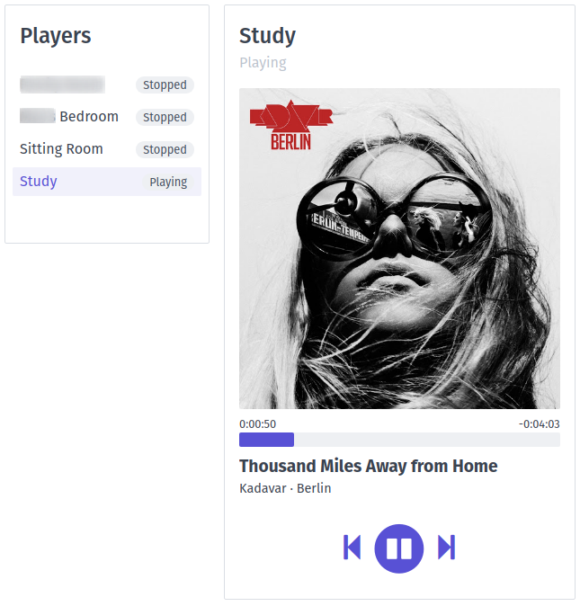

# SoundOs
Sonos Web Controller



## Introduction
I wanted a simple and easy to use Sonos controller for Linux. The ones available generally didn't work the way I wanted them to, so I set out to create this.

## Supported Operating Systems
Developed and tested on Linux only.

## Requirements
* [Python 3](https://www.python.org/)
* [Flask](https://palletsprojects.com/p/flask/)
* [SoCo](https://python-soco.com/)
* Using a CDN:
  * [Spectre CSS](https://picturepan2.github.io/spectre/)
  * [Font Awesome Free](https://fontawesome.com/)
  * [jQuery](https://www.jquery.com/)

## Installation
### From Source
Clone the repo or download the latest build
```bash
pip3 install soco flask
./soundos.sh
```
### Docker
Build the image with the [Dockerfile](Dockerfile) and use the included [docker-compose.yml](docker-compose.yml) file.

Because multicast is unsupported in a container (without fancy plugins like Weave), the docker-compose.yml requires `network_mode: host`

## Things Left To Do
- [ ] Music search
- [ ] Queue viewing
- [ ] Queue editing
- [ ] Music services
- [ ] Volume control
- [ ] System information
- [ ] Dark mode
- [x] Dockerfile and docker-compose.yml